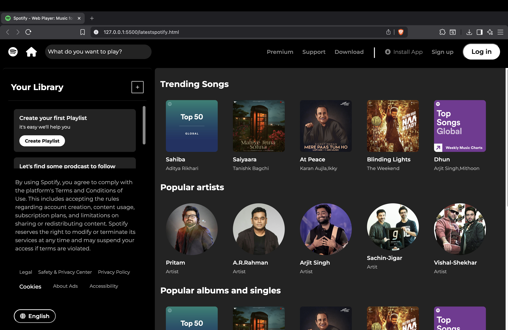

# 🎧 Spotify Clone (HTML & CSS)

A Spotify-inspired UI built using pure HTML and CSS.

This project focuses on layout design, flexbox positioning, and clean UI structuring without using any frameworks or templates.

## 🚀 Features

- Responsive layout structure
- Sidebar navigation
- Music cards section
- Hover effects
- Clean spacing and alignment
- Built completely from scratch

## 🛠 Tech Stack

- HTML5
- CSS3 (Flexbox)

## 📂 Project Structure

spotify-clone/
│
├── index.html
├── style.css
└── assets/

## 📸 Preview

## 🎯 What I Learned

- Structuring layouts using Flexbox
- Importance of spacing and alignment
- Writing clean and organized CSS
- Creating UI components from scratch

